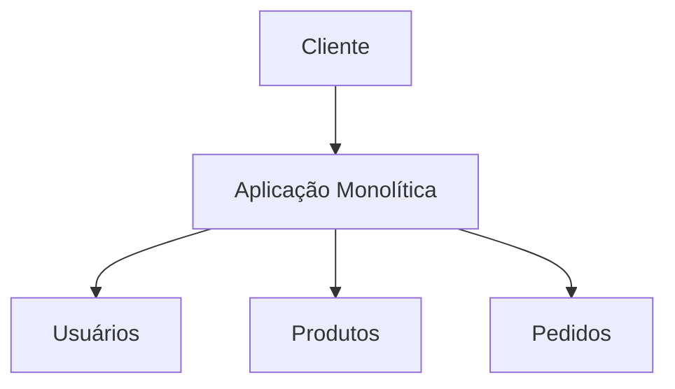
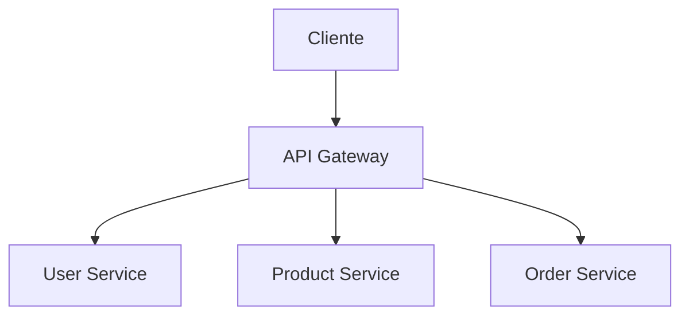
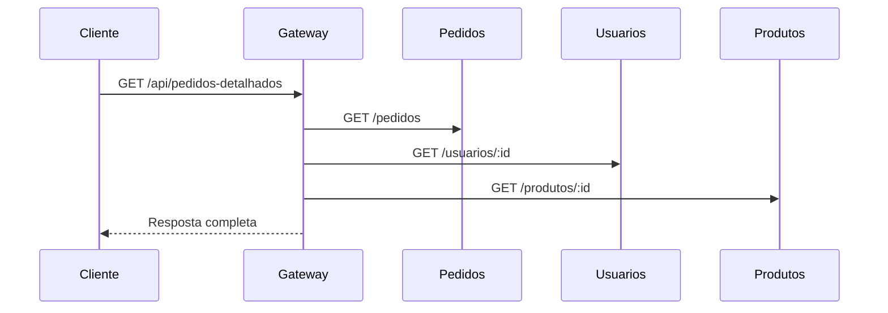

# Comparação entre Arquitetura Monolítica e Microserviços com API Gateway

## Descrição do Projeto

Este projeto tem como objetivo demonstrar, de forma prática, a diferença entre duas abordagens de desenvolvimento de sistemas:

* Arquitetura **Monolítica**
* Arquitetura de **Microserviços**

Além disso, inclui a implementação de um **API Gateway**, responsável por centralizar a comunicação entre os serviços.

O sistema simula um cenário simples com:

* usuários
* produtos
* pedidos

---

## Objetivo

* Comparar monólito vs microserviços
* Demonstrar o funcionamento do API Gateway
* Entender vantagens e desvantagens de cada arquitetura

---

## Conceitos

### - Monólito

Tudo funciona dentro de um único sistema.

### - Microserviços

O sistema é dividido em serviços independentes.

### - API Gateway

Ponto único de entrada que organiza as requisições.

---

## - Arquitetura

### Monólito



---

### Microserviços + Gateway



---

### Fluxo do sistema



---

##  Estrutura do Projeto

```
projeto/
├── monolito/
│   ├── package.json
│   └── server.js
│
└── microservices/
    ├── user-service/
    ├── product-service/
    ├── order-service/
    └── gateway/
```

---

##  Tecnologias

* Node.js
* Express
* Axios
* JSON

---

## Como executar

### 1. Instalar dependências

Dentro de cada pasta:

```bash
npm install
```

---

##  Executar MONÓLITO

```bash
cd monolito
npm start
```

### Rotas:

* http://localhost:3000/usuarios
* http://localhost:3000/produtos
* http://localhost:3000/pedidos
* http://localhost:3000/pedidos-detalhados

---

## Executar MICROSSERVIÇOS

Abrir 4 terminais:

### Terminal 1

```bash
cd microservices/user-service
npm start
```

### Terminal 2

```bash
cd microservices/product-service
npm start
```

### Terminal 3

```bash
cd microservices/order-service
npm start
```

### Terminal 4

```bash
cd microservices/gateway
npm start
```

---

##  Testar API Gateway

Clica em: http://localhost:3000/api/pedidos-detalhados

---

##  Exemplo de resposta

```json
[
  {
    "id": 1,
    "usuario": "Ana",
    "produto": "Mouse",
    "quantidade": 2,
    "precoUnitario": 500,
    "total": 1000
  }
]
```

---

##  Comparação

 Critério        Monólito  Microserviços 
 --------------  --------  ------------- 
 Simplicidade    Alta      Média         
 Organização     Baixa     Alta          
 Escalabilidade  Limitada  Melhor        
 Complexidade    Baixa     Alta          

---

##  Aprendizados

* Diferença entre monólito e microserviços
* Funcionamento do API Gateway
* Comunicação entre serviços
* Organização de sistemas

---

##  Explicação simples

* Monólito → tudo em um lugar
* Microserviços → tudo separado
* Gateway → organiza tudo

---

##  Conclusão

Este projeto mostra que:

* Monólito é mais simples
* Microserviços são mais organizados
* API Gateway melhora a comunicação

A escolha depende do tipo de sistema.

---
